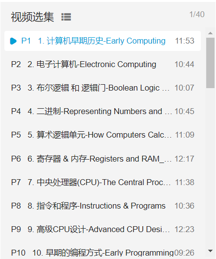
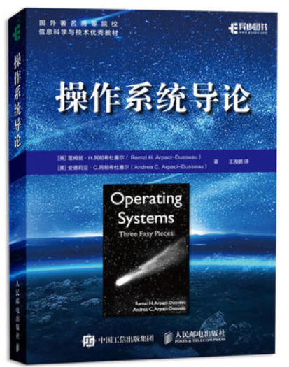
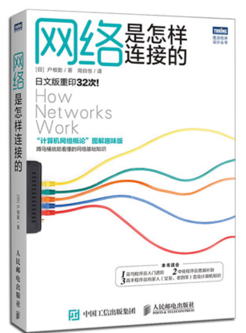
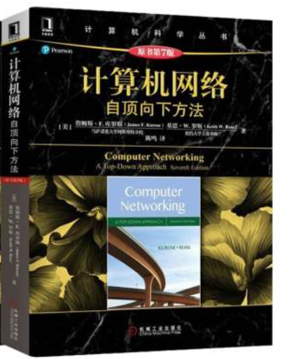
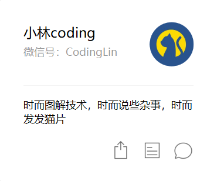

#  CodingMethod

本文讲述了**致力于后端方向**的同学如何学习编程的“编程之术”，以及一些学习上的“编程之道”。功利一点，您能从本文里获得高效学习进大厂的学习方法；长远一点，您能更具目的性进行编程学习，成为一名优秀的程序员。

[TOC]

# 编程之术

> 下文内容会用**“天”**，这个单位来衡量工作量以及学习难度，默认为4-6个小时

## 1 入门 （20天）

### 编程语言（10天）

通常来讲，入门的编程语言基本上选定了这3种：c++，Java，Python。通常而言，学校会让学习c++入门，因为**在计算机网络和操作系统的学习上，是必须要看懂c++代码的。**所以，如果您是一个大学科班学生，或者是自认为非常聪明的人，可以直接c++入门。

c++入门的同学虽然在计算机网络和操作系统的学习上占据了优势，但是一个致命的缺点就是：**c++不适合快速学习的同时快速产出**。c++的框架五花八门，远没有Java一样拥有统一的生态。除此之外，c++在编程的时候经常要处理与业务逻辑无关的内容（内存控制之类的）。所以，如果您想一边学习编程，一边快速地搞些项目出来（做个博客，做个网上商城之类的），您可以选择Java入门。

> c++和java的语法规则算是比较相似的，彼此之间切换只需学习3天左右的时间。

至于Python，那是为想学习机器学习，数据处理方向的同学准备的。Python的特点是语法规则简单，非常容易上手，但是为了以后学习操作系统和计算机网络的方便，还是建议学习c++和Java。当然，若是您觉得学习c++和Java还是有些吃力，学得不是很顺利，您也可以尝试从Python入门，重在先培养兴趣:)

### 计算机基础（10天）

编程的入门不仅仅是“10天学习一门编程语言”那么简单，还包括**对计算机本身的硬件工作有着基础的理解**，这里推荐b站的课程【计算机科学速成课】（https://www.bilibili.com/video/BV1EW411u7th?from=search&seid=13170020252703771519）：

如图可见，它用了短小精悍的视频总结概况了一名初级到中级程序员所需的所有计算机硬件知识，虽然是英文的，但是其字幕做的相当精彩，也提供了纯文字稿，非常易于学习。

学习以上这部分内容不需要编程语言基础，建议与编程语言并行学习，换换口味效率更高。

> 学完上述课程基本上可以达到**科班大二结束水平**
>
> 您可以先把《深入理解计算机系统》这本书买了，当成字典方便查阅

## 2 专业课学习（47-61天）

### 数据结构与算法（14天）

**数据结构和算法**在编程里算是“万物之基础”，但也是学起来最简单的一门课程，推荐2本书吧：

> 《大话数据结构》
>
> 《算法图解》
>
> 算法与数据结构可视化网站：https://visualgo.net/zh

学习算法与数据结构的核心方法论就是**自己实现一遍，一定不能偷懒！**。

### 操作系统（14-21天）

从这部分开始，算是进入到比较难的专业课程了。其实也不是很难，就是内容比较多。

教材的话直接推荐OSTEP（https://github.com/remzi-arpacidusseau/ostep-translations/tree/master/chinese）

本书从**虚拟化，并发，持久性**三个角度来讲解操作系统，语言风格还是比较不错的，不像其他黑皮书一样晦涩难懂，比较生动形象。其中前2部分是面试重点，持久化部分主要是磁盘相关，时间比较紧的同学可以暂时忽略。

如果看书比较困难的话，建议上b站或者中国大学慕课上看网课，边看边学，比较容易。

当学完后，想来回顾操作系统的知识的话，建议到时候看另一本书：《现代操作系统 原理与实现》。

本书的作者是上海交通大学陈海波教授，书里的语言风格更符合中国人的阅读思维。

> 本书配套的网课和实验还在建设过程中，完成后也可以成为入门操作系统学习的教材。

### 计算机网络（14-21天）

计算机网络的设计的分层的，应用层的HTTP，传输层的tcp，网络层的ip，传统的教材在教授的过程中是将他们割裂开来，一层一层地教授，这样就导致学生在学习的时候有点“空中楼阁”的感觉。所以我建议所有学习计算机网络的同学买这2本书：《网络是怎样连接的》、《计算机网络·自顶向下方法》

先看《网络是怎样连接的》在学习其中遇到不懂的问题可以去《计算机网络·自顶向下方法》里去查询。

赶时间的朋友学到ip层就可以了，更加深入的硬件部分在阅读的时候可以适当地忽略。

### 数据库（5天）

这个说白了就是SQL语句的学习，直接菜鸟教程就可以了，装个MySQL，实践所有的SQL语句就可以了。

注意，一点要动手哦。

## 3 做项目（3-21天）

> 一个小项目3天，一个中项目7-14天，一个大项目21天

所谓项目，其实就是某个东西，比如自己写个网站，做个APP就算项目，不必把项目当成什么高大上的东西。实际上做项目就一个发挥想象力的事情，以一个基本框架为载体，往上面加入自己喜欢的功能就算一个项目。

### 小项目（3-5天）

简单点的，比如写个**亚马逊爬虫**，完成如下任务：

> **给定一个有排行榜URL，将排行榜上的所有商品及其标签存到数据库里**

这算一个玩具项目，3-5天就完成了，适合写简历时缺少项目临时凑数使用

### 中项目（7-14天）

比如自己写一个PDF处理工具：

> 找到对应编程语言的PDF处理库（c++，Java，Python都有），然后自己实现PDF的裁剪页面等等功能。
>
> 功能越多实现的时间也就越多

这种中项目建议是自己有时间有兴趣就弄弄看，最好是解决某个实际问题，**面试的时候用来体现自己平时观察生活，使用编程技术解决现实问题**的优点。

### 大项目（21天）

大项目就是那种放在简历上最显眼的位置，也是最体验个人能力的项目。若是自己没有方向的话，去b站、csdn、知乎上搜索一些也有很多资源。一般关键词是编程语言或者某技术，如“java入门项目”之类的。这里以b站为例：

搜索 `java项目` 就会出现如下视频，可以在其中找找自己喜欢的方向。

选定自己喜欢的方向后，可以在用关键词搜索得到更多的资源，比如想做一个电子商城（仿淘宝），那我可以搜索 `java 电商项目` 

选择项目的标准如下：

1. 课程完整
2. 有源码
3. 老师讲课逻辑清晰
4. 时间越新越好

常见的比较好的项目培训机构有：尚硅谷、黑马之类的，可以看看他们的课程，都在b站有账号。当然，买不买课就看你自己需求了，一般自学就行。

## 4 面试方法论

> 基本上完成以上内容，就可以准备面试了，默认简历已经写完，投了若干家公司的后台开发岗，正在等待面试中。
>
> 主要有如下内容
>
> - 算法+数据结构（笔试也考）
> - 操作系统
> - 计算机网络
> - 数据库
> - 编程语言基础
> - 项目逻辑+应用框架

### 面试内容

面试的内容无非就如下几个部分：

#### 1）算法与数据结构

这个是最让人头疼的，只能用时间去刷题：刷题网站leetcode（https://leetcode-cn.com/problemset/all/）

不过有个好消息，对于面试和笔试的算法题，有大佬（https://github.com/labuladong/fucking-algorithm）做了总结，写了本书

“踏踏实实跟着书刷，笔试面试随便乱杀”

#### 2）基础知识

> - 操作系统
> - 计算机网络
> - 数据库
> - 编程语言基础

这个背就完事了，一回生二回熟，建议关键词搜索 **例如`操作系统 面经`**，基本上看个几遍就没问题了。这里推荐一个公众号：小林coding

公众号里面的图解系列十分不错，适合准备面试的时候快速巩固。

#### 3）项目逻辑+应用框架

假设你用java的spring实现了某个电商平台，那么面试官就会问你

- xxx功能是如何实现的？
- 讲一下spring框架的原理？
- 你这个项目支持高并发吗？
- 在xxx情况下，你的这个功能会怎么处理？

对于这些问题，要对自己的项目熟练与心才行，纯粹地背诵是没有用的，面试官3个问题就能问出来你是否有自己的理解。

### 面试准备

在准备面试的时候，首先要保证上面的内容都比较熟悉。将上述内容掌握背熟后，**可以找学长或同学来模拟面试**。比如你当面试官去面试别人，你就能感受到面试官真正在意什么，以及究竟有什么“坑”。

**当你当过一次面试官后，你就会发现，面试者虽然操作系统相关的知识回答上来了，但是回答地非常磕巴，这就代表着他对操作系统不熟练（尽管他最后回答上来了）。这样就可以反思，自己回答的时候，可以回答地慢一些，保证总体比较流利。**

模拟面试后双方可以相互交流一下，学习一些知识以外的面试技巧。

# 编程之道